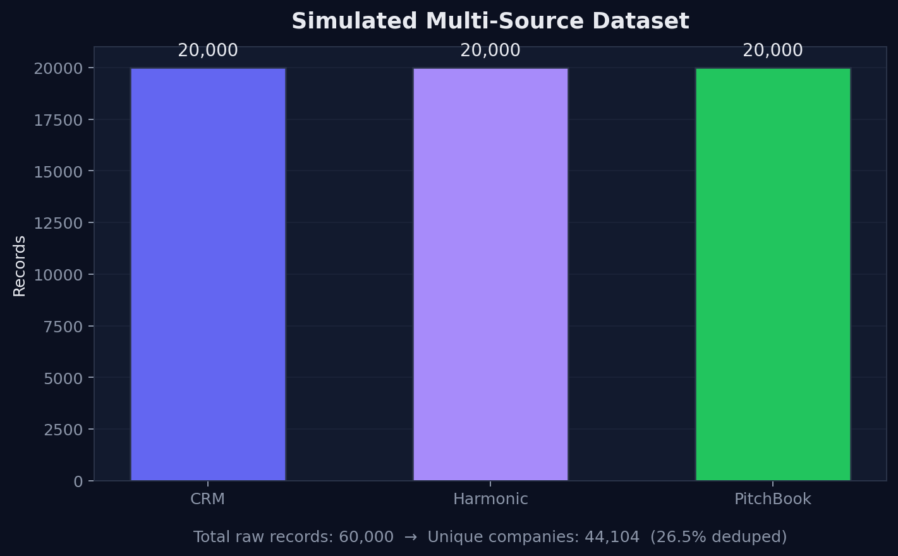
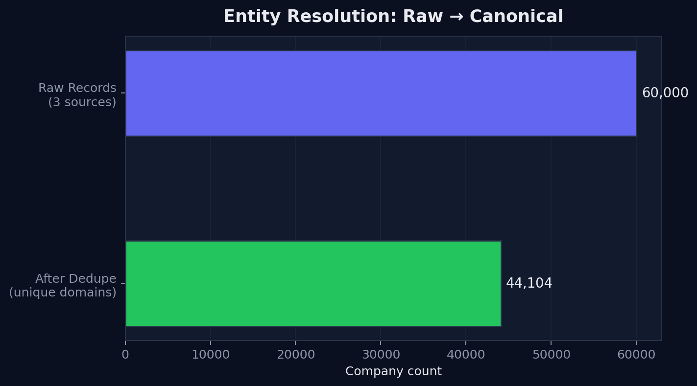
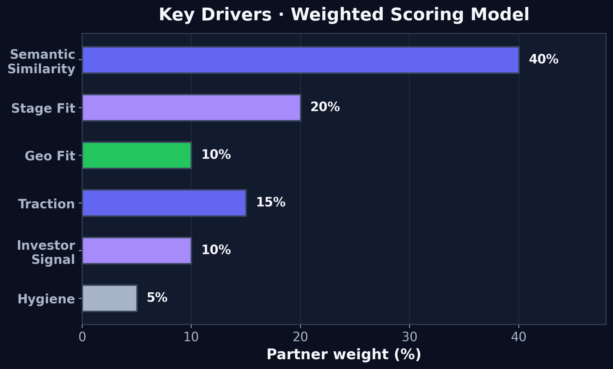
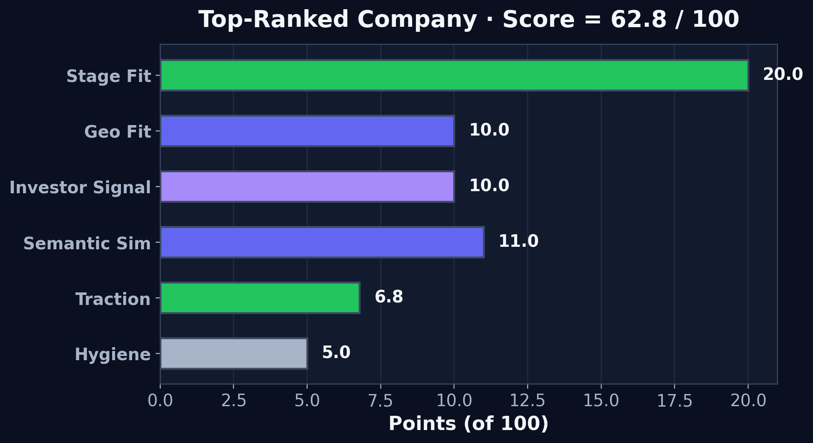
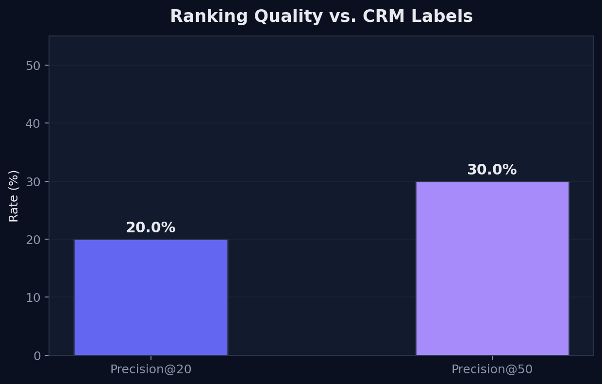
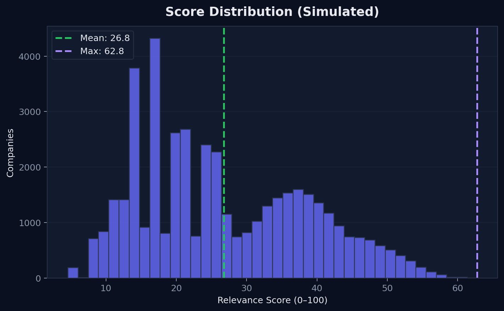

## {.title-slide}

::: {.fit-text .text-primary}
From Startup Chaos to Smart Deal Flow
:::

### Using AI to Help VCs Pick Better Companies

**Eesha Jagdhane** · MGTA 495 · Marketing Analytics

::: {.slide-tagline .text-muted}
Marketing analytics applied to venture capital — turning messy deal flow into smarter, prioritized investment decisions.
:::

::: {.fragment .fade-up}
All quantitative results in this deck come from a **simulated multi-source VC dataset**. The pipeline design mirrors a real end-to-end build.
:::

## The Problem {transition="slide"}

::: {.slide-intro}
VCs review thousands of startups, but partner time and attention are limited.
:::

::: {.columns}
::: {.column width="48%"}
::: {.metric-row}
::: {.metric-card .green-glow}
::: {.metric-value}
60,000
:::
::: {.metric-label}
Raw startup records
:::
:::
::: {.metric-card}
::: {.metric-value}
~44K
:::
::: {.metric-label}
Unique after dedupe
:::
:::
::: {.metric-card}
::: {.metric-value}
3
:::
::: {.metric-label}
Data sources
:::
:::
:::

::: {.fragment .fade-up}
::: {.incremental}
- Signals live across **CRM**, **Harmonic**, and **PitchBook**
- Partner time is the scarcest resource
- Most deals never get a real look
- Great companies get lost in the noise
:::
:::

::: {.fragment .fade-up .callout}
The issue is not a lack of data — it is **too much scattered data** and **not enough partner attention**.
:::
:::

::: {.column width="52%"}
{.slide-img}

::: {.caption}
Simulated CRM, Harmonic, and PitchBook exports · 20,000 records each
:::
:::
:::

## Before AI {transition="fade"}

::: {.slide-intro}
The traditional process is manual, inconsistent, and hard to scale.
:::

::: {.flow-steps}
::: {.flow-step}
CRM Data
:::
::: {.flow-arrow}
→
:::
::: {.flow-step}
Spreadsheets
:::
::: {.flow-arrow}
→
:::
::: {.flow-step}
Manual Research
:::
::: {.flow-arrow}
→
:::
::: {.flow-step}
PitchBook / Harmonic
:::
::: {.flow-arrow}
→
:::
::: {.flow-step .muted}
Gut Feeling
:::
::: {.flow-arrow}
→
:::
::: {.flow-step .muted}
Partner Review
:::
:::

::: {.pain-tags}
::: {.pain-tag}
Slow
:::
::: {.pain-tag}
Inconsistent
:::
::: {.pain-tag}
Hard to Scale
:::
::: {.pain-tag}
Data Silos
:::
:::

::: {.callout .callout-accent}
Manual screening is uneven and time-bound — high-potential startups slip through when analysts cannot research every company the same way.
:::

## AI-Assisted Deal Flow {transition="convex"}

::: {.slide-intro}
AI gives deal flow a brain — unified data, faster insight, and prioritized review.
:::

::: {.fragment .fade-up}
::: {.flow-steps}
::: {.flow-step .highlight}
AI Summaries
:::
::: {.flow-step .highlight}
Investment Signals
:::
::: {.flow-step .highlight-green}
Relevance Scoring
:::
::: {.flow-step .highlight-green}
Prioritized Deal Flow
:::
:::
:::

::: {.fragment .fade-up .callout .callout-success}
**Relevance scoring is not a black-box model** — it is a transparent weighted layer that ranks companies using partner-selected investment criteria.
:::

::: {.fragment .fade-up}
AI doesn't replace judgment — it **front-loads intelligence** so investors spend time where it matters.
:::

## The Data {transition="slide"}

::: {.slide-intro}
A fully synthetic dataset with the same structure as real VC exports — privacy-safe, demo-ready.
:::

::: {.columns}
::: {.column width="55%"}
| Source | Records | Key fields |
|--------|--------:|------------|
| Simulated CRM | 20,000 | Status, thesis area, geo, funding, investors |
| Simulated Harmonic | 20,000 | Descriptions, headcount, 90d growth, tags |
| Simulated PitchBook | 20,000 | Industry, verticals, financing, HQ |

::: {.fragment .fade-up}
- **~40% intentional overlap** across sources to test entity resolution
- CRM labels: **~5,400 positive** · **~14,600 negative**
- No real company names or contact information in this deck
:::
:::

::: {.column width="45%"}
{.slide-img .slide-img-sm}

::: {.caption}
60,000 raw → 44,104 unique companies · **26.5%** dedupe rate
:::
:::
:::

## Key Drivers {transition="zoom" #marketing-analytics}

::: {.slide-intro}
Segment the universe, then rank companies with a transparent weighted scoring model partners control.
:::

::: {.formula-box}
**Score (0–100)** = Σ (Partner Weight × Driver Score)
:::

::: {.columns}
::: {.column width="50%"}
{.slide-img .slide-img-sm}

::: {.caption}
Six key drivers · weights sum to 100%
:::
:::

::: {.column width="50%"}
::: {.fragment .fade-up}
| Driver | Weight | How calculated |
|--------|-------:|------------------|
| Semantic similarity | 40% | Thesis vs. company text · cosine similarity |
| Stage fit | 20% | Rule-based match to Seed / Early |
| Geo fit | 10% | Rule-based match to target geographies |
| Traction | 15% | Headcount growth + funding recency |
| Investor signal | 10% | Normalized investor count |
| Hygiene | 5% | Data completeness score |
:::

::: {.fragment .fade-up .callout}
**Not** a Random Forest or MSE model — this is **attribution-style explainability**: every score decomposes into points per driver.
:::
:::
:::

## Score Breakdown {transition="fade"}

::: {.slide-intro}
Every ranked company gets a transparent point contribution per driver — like marketing attribution.
:::

::: {.columns}
::: {.column width="52%"}
{.slide-img}

::: {.caption}
Top-ranked company · Score = **62.8 / 100** (simulated)
:::
:::

::: {.column width="48%"}
::: {.metric-row}
::: {.metric-card .green-glow}
::: {.metric-value}
62.8
:::
::: {.metric-label}
Max score
:::
:::
::: {.metric-card}
::: {.metric-value}
26.8
:::
::: {.metric-label}
Mean score
:::
:::
::: {.metric-card}
::: {.metric-value}
6
:::
::: {.metric-label}
Drivers
:::
:::
:::

::: {.fragment .fade-up}
Top contributors for the #1 company:

::: {.incremental}
1. **Stage fit** — 20.0 pts
2. **Geo fit** — 10.0 pts
3. **Investor signal** — 10.0 pts
4. **Semantic similarity** — ~11.0 pts
5. **Traction** — ~6.8 pts
6. **Hygiene** — 5.0 pts
:::
:::

::: {.fragment .fade-up .callout}
Partners can reweight drivers by thesis — e.g., raise stage weight for a Series A focus, or semantic weight for a narrow AI-infra mandate.
:::
:::
:::

## Results {transition="slide"}

::: {.slide-intro}
Did the ranking match historical CRM disposition labels?
:::

::: {.columns}
::: {.column width="48%"}
{.slide-img .slide-img-sm}

::: {.caption}
Backtested against simulated CRM positive / negative labels
:::
:::

::: {.column width="52%"}
::: {.metric-row .metric-row-4}
::: {.metric-card .green-glow}
::: {.metric-value}
20%
:::
::: {.metric-label}
Precision@20
:::
:::
::: {.metric-card}
::: {.metric-value}
30%
:::
::: {.metric-label}
Precision@50
:::
:::
::: {.metric-card}
::: {.metric-value}
5.4K
:::
::: {.metric-label}
CRM positives
:::
:::
::: {.metric-card}
::: {.metric-value}
50
:::
::: {.metric-label}
AI summaries
:::
:::
:::

{.slide-img .slide-img-sm}
:::
:::

::: {.callout .callout-success}
The model is **selective** — mean score ~26.8, max ~62.8 — not inflating every company to the top of the list.
:::

## Impact & The AI Arms Race {transition="fade"}

::: {.slide-intro}
The goal is not to replace investors — it is to help them focus.
:::

::: {.impact-grid}
::: {.impact-item}
**Less Manual Screening**
Automate the first pass across thousands of companies
:::
::: {.impact-item}
**Faster Review**
AI summaries cut research time from hours to minutes
:::
::: {.impact-item}
**Consistent Scoring**
Every deal evaluated with the same framework
:::
::: {.impact-item}
**Better Data Use**
CRM, Harmonic, and PitchBook signals unified
:::
::: {.impact-item}
**Easier Prioritization**
Ranked deal flow replaces gut-only triage
:::
::: {.impact-item}
**Hidden Gems Found**
Strong startups surface before competitors notice
:::
:::

::: {.fragment .fade-up}
::: {.callout .callout-accent}
**The AI arms race:** If VCs use AI to review startups, founders may use AI to optimize pitches. To avoid AI evaluating AI-generated language, rely on harder-to-fake signals: **funding history, headcount growth, investor quality, traction, and human judgment**.
:::
:::

::: {.fragment .fade-up}
> AI can polish a pitch, but it cannot easily fake traction.
:::

::: {.fragment .fade-up .closing-line}
This project applies marketing analytics thinking to venture capital: using **segmentation, weighted scoring, and attribution** to turn messy deal flow into smarter investment decisions.
:::
