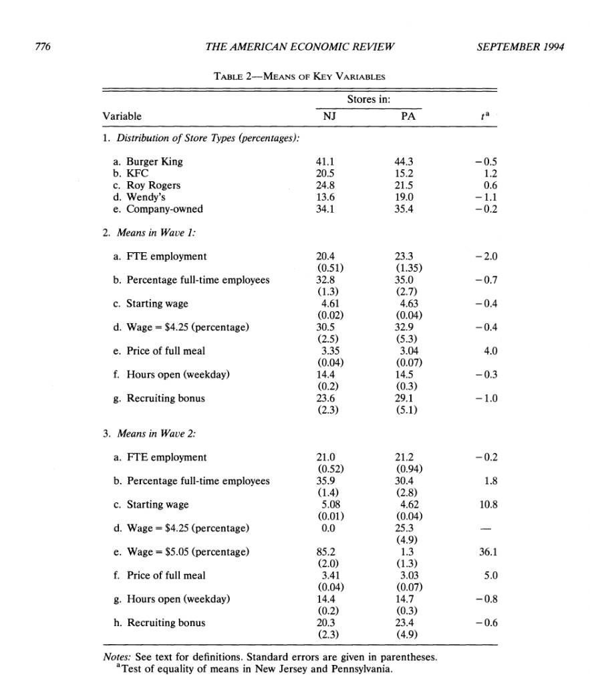
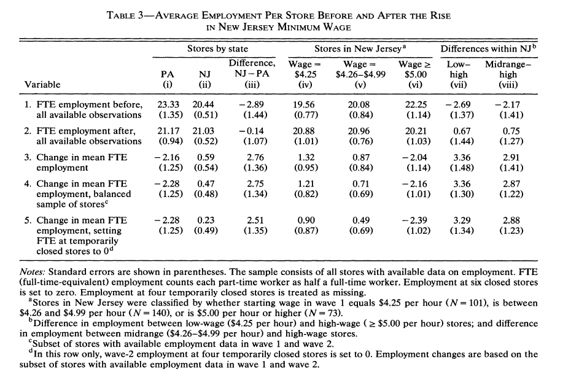
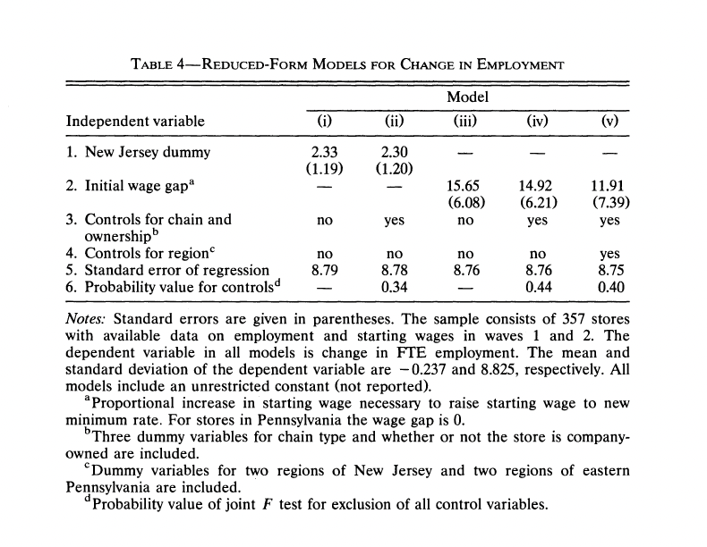

```{=html}
<link href="https://fonts.googleapis.com/css2?family=Playfair+Display:wght@700;900&family=DM+Sans:wght@300;400;500&display=swap" rel="stylesheet">
<style>
  * { margin: 0; padding: 0; box-sizing: border-box; }
  body { background: #f0ece4; color: #2e2825; font-family: 'DM Sans', sans-serif; }
  a { color: inherit; text-decoration: none; }
  .nav {
    display: flex; justify-content: space-between; align-items: center;
    padding: 1.5rem 4rem; border-bottom: 1px solid #c9c2b6;
    background: #f0ece4; position: sticky; top: 0; z-index: 10;
  }
  .nav-logo { font-size: 0.85rem; letter-spacing: 0.1em; text-transform: uppercase; color: #7a3b35; }
  .nav-links { display: flex; gap: 2rem; list-style: none; }
  .nav-links a {
    font-size: 0.8rem; color: #8a8278; text-transform: uppercase;
    letter-spacing: 0.08em; padding: 0.4rem 0.75rem; display: inline-block;
    transition: color 0.2s, background 0.2s, transform 0.2s;
  }
  .nav-links a:hover { color: #2e2825; background: #e8e3da; transform: translateY(-2px); }
  .nav-cta {
    background: #2e2825; color: #f0ece4; padding: 0.5rem 1.2rem;
    font-size: 0.8rem; letter-spacing: 0.08em; text-transform: uppercase;
    transition: background 0.2s;
  }
  .nav-cta:hover { background: #7a3b35; }
  .post-header {
    padding: 5rem 4rem 3rem;
    border-bottom: 1px solid #c9c2b6;
    max-width: 860px;
  }
  .post-tag { font-size: 0.7rem; color: #7a3b35; letter-spacing: 0.2em; text-transform: uppercase; margin-bottom: 0.5rem; }
  .post-title {
    font-family: 'Playfair Display', serif;
    font-size: clamp(2rem, 4vw, 3.5rem);
    font-weight: 900; line-height: 1.1; color: #2e2825; margin-bottom: 0.5rem;
  }
  .post-subtitle { font-size: 1rem; color: #8a8278; margin-bottom: 1rem; font-style: italic; }
  .post-meta { font-size: 0.75rem; color: #8a8278; }
  .back-link {
    display: inline-block; margin: 2rem 4rem 0;
    font-size: 0.75rem; color: #7a3b35;
    border-bottom: 1px solid #c9a09b; padding-bottom: 2px;
    letter-spacing: 0.08em; text-transform: uppercase;
    transition: color 0.2s, border-color 0.2s;
  }
  .back-link:hover { color: #2e2825; border-color: #2e2825; }
  .post-body { padding: 3rem 4rem 5rem; max-width: 860px; }
  .post-body h2 {
    font-family: 'Playfair Display', serif;
    font-size: 1.8rem; font-weight: 700;
    color: #2e2825; margin: 3rem 0 1rem;
    padding-bottom: 0.5rem; border-bottom: 1px solid #c9c2b6;
  }
  .post-body h3 { font-size: 1.1rem; font-weight: 500; color: #2e2825; margin: 2rem 0 0.75rem; }
  .post-body p { font-size: 0.95rem; color: #6b6560; line-height: 1.9; margin-bottom: 1.25rem; }
  .post-body ul, .post-body ol { padding-left: 1.5rem; margin-bottom: 1.25rem; }
  .post-body li { font-size: 0.95rem; color: #6b6560; line-height: 1.9; margin-bottom: 0.4rem; }
  .post-body strong { color: #2e2825; font-weight: 500; }
  .post-body em { color: #7a3b35; font-style: italic; }
  pre { background: #e8e3da !important; border: 1px solid #c9c2b6 !important; border-radius: 2px !important; padding: 1rem !important; }
  code { font-size: 0.85rem !important; color: #2e2825 !important; }
  table { width: 100%; border-collapse: collapse; margin: 1.5rem 0; font-size: 0.88rem; }
  thead tr { border-bottom: 2px solid #c9c2b6; }
  th { text-align: left; padding: 0.6rem 1rem; font-weight: 500; color: #2e2825; font-size: 0.8rem; text-transform: uppercase; letter-spacing: 0.06em; }
  td { padding: 0.6rem 1rem; color: #6b6560; border-bottom: 1px solid #e8e3da; }
  tbody tr:last-child td { border-bottom: none; }
  .footer-bar {
    margin: 0 4rem; padding: 2rem 0;
    border-top: 1px solid #c9c2b6;
    display: flex; justify-content: space-between;
    font-size: 0.7rem; color: #8a8278;
  }
  @media (max-width: 800px) {
    .nav { padding: 1rem 1.5rem; }
    .post-header, .post-body { padding: 3rem 1.5rem; }
    .back-link { margin: 1.5rem; }
    .footer-bar { margin: 0 1.5rem; flex-direction: column; gap: 0.5rem; }
  }
  /* Folded code: Quarto wraps source in <details>; style summary as a button + state hint */
  body details:has(pre.sourceCode) {
    margin: 0 0 1.25rem 0;
    border: 1px solid #c9c2b6;
    border-radius: 2px;
    background: #e8e3da;
    padding: 0;
  }
  body details:has(pre.sourceCode) > summary {
    cursor: pointer;
    list-style: none;
    font-family: 'DM Sans', sans-serif;
    font-size: 0.72rem;
    font-weight: 500;
    text-transform: uppercase;
    letter-spacing: 0.1em;
    color: #f0ece4;
    background: #2e2825;
    border: none;
    border-radius: 2px 2px 0 0;
    padding: 0.55rem 1rem;
    margin: 0;
    display: flex;
    align-items: center;
    justify-content: space-between;
    gap: 0.75rem;
  }
  body details:has(pre.sourceCode) > summary::-webkit-details-marker { display: none; }
  body details:has(pre.sourceCode) > summary::marker { content: ''; }
  body details:has(pre.sourceCode) > summary::after {
    content: "collapsed";
    font-size: 0.68rem;
    font-weight: 400;
    text-transform: uppercase;
    letter-spacing: 0.06em;
    color: #c9c2b6;
    border: 1px solid #8a8278;
    border-radius: 2px;
    padding: 0.2rem 0.5rem;
    flex-shrink: 0;
  }
  body details:has(pre.sourceCode)[open] > summary {
    background: #7a3b35;
    border-bottom: 1px solid #c9a09b;
    border-radius: 2px 2px 0 0;
  }
  body details:has(pre.sourceCode)[open] > summary::after {
    content: "expanded";
    color: #f0ece4;
    border-color: #f0ece4;
  }
  body details:has(pre.sourceCode) pre.sourceCode {
    margin: 0 !important;
    border-radius: 0 0 2px 2px !important;
    border-top: none !important;
  }
</style>

<div class="nav">
  <span class="nav-logo">Eesha Jagdhane // Portfolio</span>
  <ul class="nav-links">
    <li><a href="../../index.html">Home</a></li>
    <li><a href="../../blogs.html">Blogs &amp; Insights</a></li>
  </ul>
  <a href="../../index.html#contact" class="nav-cta">Get in touch</a>
</div>

<div class="post-header">
  <div class="post-tag">Assignment 2 — Marketing Analytics</div>
  <div class="post-title">Minimum Wages and Employment</div>
  <div class="post-subtitle">Replication notes for Card and Krueger (1994)</div>
  <div class="post-meta">Eesha Jagdhane &nbsp;·&nbsp; April 22, 2026</div>
</div>

<a href="../../blogs.html" class="back-link">← Back to Blogs &amp; Insights</a>

<div class="post-body">
```

## Introduction

In 1992, New Jersey raised its minimum wage while neighboring Pennsylvania did not. David Card and Alan Krueger exploited this policy discontinuity as a *natural experiment*: fast-food restaurants in eastern Pennsylvania serve as a comparison group for restaurants in New Jersey that faced the same local demand shocks but not the same minimum-wage shock. The authors surveyed stores before and after the policy change and compared employment, wages, and prices across states and across waves.

The paper became famous because it challenged a simple textbook prediction that a higher minimum wage must reduce employment, at least in the short run, in a low-wage, high-turnover industry where firms have some wage-setting power and adjustment margins beyond immediate layoffs. The “NJ vs. PA” comparison is the key identification move: it supplies a plausible counterfactual trend for what would have happened in New Jersey absent the reform.

This post **replicates the headline tables** your professor highlighted (Table 2, the upper-left \(3\times 3\) block of Table 3, and Table 4 column (i)) using the public-use flat file (`public.dat`), the ASCII `codebook`, and the variable logic in David Card’s `check.sas` replication file.

For grading transparency, I also embed **screenshots of the published tables** side-by-side with my reproduced numbers.

### Methodological note: why DiD is stronger than “NJ only”

A before-and-after comparison in New Jersey alone conflates the minimum wage increase with *any* aggregate trend affecting fast-food employment between early 1992 and late 1992 (seasonality, local demand, macro shocks, supply disruptions, and so on). A Pennsylvania control group is meant to absorb those common shocks under a parallel trends assumption: absent the policy, NJ and PA would have evolved similarly. The difference-in-differences estimand compares *changes* across states, which removes time-invariant differences between regions and isolates a policy-induced shift relative to a credible counterfactual trend.

## Data processing

The public-use file is fixed-width ASCII (410 stores). Column locations follow the `codebook` file in `njmin/`, and variable definitions follow `check.sas` (for example, `EMPTOT` and `GAP`).

## Table 2 (published means + standard errors)

Card and Krueger’s Table 2 summarizes store composition and Wave 1 / Wave 2 means for a set of key variables. Below, I reproduce the **same rows shown in your screenshot** (store-type shares, FTE, % full-time, wages, meal price, hours, recruiting bonus).

Standard errors are computed as \(s / \sqrt{n}\) within each state, where \(s\) is the sample standard deviation and \(n\) is the count of non-missing stores for that variable.



## Table 3 (the \(3\times 3\) block: columns (i)–(iii), rows 1–3)

This is the “NJ vs PA” comparison in the top-left of Table 3:

- **Columns:** Pennsylvania, New Jersey, NJ − PA
- **Rows:** Wave 1 mean FTE, Wave 2 mean FTE, change in mean FTE (mean after − mean before)

**Closures:** following the paper’s discussion, **permanently closed** stores (`STATUS2 = 3`) have Wave 2 employment set to **0** when computing Wave 2 means. (Temporarily closed / missing Wave 2 employment are handled as missing in these first rows, matching the published counts like \(n=319\) for NJ Wave 2 FTE.)

**Rows 1–2:** standard errors are \(s/\sqrt{n}\) within each state, as in Table 2.

**Row 3 (change):** the point estimate is **mean(Wave 2 FTE) − mean(Wave 1 FTE)** in each state (the same object CK prints in the table). The standard errors in parentheses for PA and NJ are **\(s_{\Delta}/\sqrt{n_{\text{both}}}\)** where \(\Delta_i =\) Wave 2 − Wave 1 for stores with **non-missing FTE in both waves** (a paired cohort). That rule matches CK’s Pennsylvania **(1.25)** very closely on this public file; New Jersey is a bit below CK’s **(0.54)**, which is expected when Wave‑1 and Wave‑2 samples differ slightly in the ASCII extract.

For **NJ − PA**, the standard error is \(\sqrt{SE_{NJ}^2 + SE_{PA}^2}\) using the row‑3 state standard errors above.



## Table 4, column (i): OLS of $\Delta FTE$ on the NJ dummy

This is the simplest “difference-in-differences in regression form” specification:

$$
\Delta FTE_i = \alpha + \beta \cdot NJ_i + u_i
$$

To match the paper’s Table 4 footnote (“**357 stores** with available data in both waves”), I use the **`C1` subset logic from `check.sas`**:

- `DEMP` (here: \(\Delta FTE\)) is non-missing, **and**
- either the store is **permanently closed** in Wave 2 (`STATUS2 = 3`), **or** the store has a **non-missing wage change** \(\Delta wage = wage_{2}-wage_{1}\).

This is exactly the `IF CLOSED=1 OR (CLOSED=0 AND DWAGE NE .);` filter in `check.sas`, and it yields **\(n=357\)** in this ASCII public-use file.

Standard errors are the **homoskedastic OLS** standard errors (not HC1), matching the style of the published table.



## Something additional: a DiD plot

This figure summarizes the Table 3 comparison visually: Pennsylvania provides the “would have happened anyway” trend between waves, while New Jersey deviates upward in the second wave relative to that benchmark.

```{python}
#| fig-cap: "Average FTE employment before and after the minimum-wage increase, by state (public-use sample)."

from __future__ import annotations

from pathlib import Path

import matplotlib.pyplot as plt
import numpy as np
import pandas as pd
import seaborn as sns
import statsmodels.api as sm
from IPython.display import Markdown, display


def markdown_table(headers: list[str], rows: list[list[str]]) -> str:
    out = []
    out.append("| " + " | ".join(headers) + " |")
    out.append("| " + " | ".join(["---"] * len(headers)) + " |")
    for r in rows:
        out.append("| " + " | ".join(r) + " |")
    return "\n".join(out)


plt.rcParams.update({
    "figure.facecolor": "#f0ece4",
    "axes.facecolor":   "#e8e3da",
    "axes.grid": True,
    "grid.color": "#c9c2b6",
    "grid.linewidth": 0.7,
    "axes.spines.top": False,
    "axes.spines.right": False,
    "axes.spines.left": False,
    "axes.spines.bottom": False,
    "font.family": "sans-serif",
    "axes.titlesize": 12,
    "axes.labelsize": 10,
    "xtick.labelsize": 9,
    "ytick.labelsize": 9,
    "text.color": "#2e2825",
    "axes.labelcolor": "#2e2825",
    "xtick.color": "#8a8278",
    "ytick.color": "#8a8278",
})

DATA_PATH = Path("njmin/public.dat")

# Codebook columns are 1-based inclusive; pandas colspecs are 0-based [start, end).
colspecs = [
    ("SHEET", 0, 3),
    ("CHAIN", 4, 5),
    ("CO_OWNED", 6, 7),
    ("STATE", 8, 9),
    ("SOUTHJ", 10, 11),
    ("CENTRALJ", 12, 13),
    ("NORTHJ", 14, 15),
    ("PA1", 16, 17),
    ("PA2", 18, 19),
    ("SHORE", 20, 21),
    ("NCALLS", 22, 24),
    ("EMPFT", 25, 30),
    ("EMPPT", 31, 36),
    ("NMGRS", 37, 42),
    ("WAGE_ST", 43, 48),
    ("INCTIME", 49, 54),
    ("FIRSTINC", 55, 60),
    ("BONUS", 61, 62),
    ("PCTAFF", 63, 68),
    ("MEALS", 69, 70),
    ("OPEN", 71, 76),
    ("HRSOPEN", 77, 82),
    ("PSODA", 83, 88),
    ("PFRY", 89, 94),
    ("PENTREE", 95, 100),
    ("NREGS", 101, 103),
    ("NREGS11", 104, 106),
    ("TYPE2", 107, 108),
    ("STATUS2", 109, 110),
    ("DATE2", 111, 117),
    ("NCALLS2", 118, 120),
    ("EMPFT2", 121, 126),
    ("EMPPT2", 127, 132),
    ("NMGRS2", 133, 138),
    ("WAGE_ST2", 139, 144),
    ("INCTIME2", 145, 150),
    ("FIRSTIN2", 151, 156),
    ("SPECIAL2", 157, 158),
    ("MEALS2", 159, 160),
    ("OPEN2R", 161, 166),
    ("HRSOPEN2", 167, 172),
    ("PSODA2", 173, 178),
    ("PFRY2", 179, 184),
    ("PENTREE2", 185, 190),
    ("NREGS2", 191, 193),
    ("NREGS112", 194, 196),
]

df = pd.read_fwf(
    DATA_PATH,
    colspecs=[(a, b) for _, a, b in colspecs],
    names=[n for n, _, _ in colspecs],
    dtype=str,
)

for c in df.columns:
    df[c] = df[c].str.strip()

num_cols = [c for c in df.columns if c != "SHEET"]
df[num_cols] = df[num_cols].apply(pd.to_numeric, errors="coerce")

df["NJ"] = (df["STATE"] == 1).astype(int)

df["FTE_W1"] = df["EMPFT"] + df["NMGRS"] + 0.5 * df["EMPPT"]
df["FTE_W2_RAW"] = df["EMPFT2"] + df["NMGRS2"] + 0.5 * df["EMPPT2"]

# Permanently closed stores: wave-2 employment is 0 (homework instruction; STATUS2 == 3).
df["FTE_W2"] = np.where(df["STATUS2"] == 3, 0.0, df["FTE_W2_RAW"])

df["PMEAL_W1"] = df["PSODA"] + df["PFRY"] + df["PENTREE"]
df["PMEAL_W2"] = df["PSODA2"] + df["PFRY2"] + df["PENTREE2"]

# % full-time employees (CK definition used in replications: EMPFT / EMPTOT, where EMPTOT = FTE)
df["PFT_W1"] = np.where(df["FTE_W1"] > 0, df["EMPFT"] / df["FTE_W1"], np.nan)
df["PFT_W2"] = np.where(df["FTE_W2"] > 0, df["EMPFT2"] / df["FTE_W2"], np.nan)

# Wage indicators
df["WAGE425_W1"] = (df["WAGE_ST"] == 4.25).astype(float)
df["WAGE425_W2"] = (df["WAGE_ST2"] == 4.25).astype(float)
df["WAGE505_W2"] = (df["WAGE_ST2"] == 5.05).astype(float)

# Recruiting bonus indicators (0/1 in public data)
df["BONUS_W1"] = (df["BONUS"] == 1).astype(float)
df["BONUS_W2"] = (df["SPECIAL2"] == 1).astype(float)

# Wage change (used for Table 4 sample selection in check.sas)
df["DWAGE"] = df["WAGE_ST2"] - df["WAGE_ST"]

# GAP definition from check.sas (useful for extensions beyond Table 4 col. (i))
df["GAP"] = np.where(df["STATE"] == 0, 0.0, np.nan)
mask_nj_below = (df["STATE"] == 1) & df["WAGE_ST"].notna()
df.loc[mask_nj_below & (df["WAGE_ST"] >= 5.05), "GAP"] = 0.0
df.loc[mask_nj_below & (df["WAGE_ST"] > 0) & (df["WAGE_ST"] < 5.05), "GAP"] = (5.05 - df["WAGE_ST"]) / df["WAGE_ST"]

df["D_FTE"] = df["FTE_W2"] - df["FTE_W1"]

closed = df["STATUS2"] == 3
table4_mask = df["D_FTE"].notna() & (closed | ((~closed) & df["DWAGE"].notna()))
reg_df = df.loc[table4_mask].copy()

display(Markdown("### Peek at the loaded data"))
display(df.head())


def mean_se(x: pd.Series) -> tuple[float, float, int]:
    v = x.dropna().astype(float)
    n = int(v.shape[0])
    if n == 0:
        return float("nan"), float("nan"), 0
    m = float(v.mean())
    if n <= 1:
        return m, float("nan"), n
    s = float(v.std(ddof=1))
    return m, float(s / np.sqrt(n)), n


def fmt_mean_se(m: float, se: float) -> str:
    if np.isnan(m):
        return ""
    if np.isnan(se):
        return f"{m:.2f}"
    return f"{m:.2f} ({se:.2f})"


def t_equal_means(nj: pd.Series, pa: pd.Series) -> str:
    a = nj.dropna().astype(float)
    b = pa.dropna().astype(float)
    if a.size < 2 or b.size < 2:
        return "—"

    ma = float(a.mean())
    mb = float(b.mean())
    va = float(a.var(ddof=1))
    vb = float(b.var(ddof=1))
    na = int(a.size)
    nb = int(b.size)

    se = float(np.sqrt(va / na + vb / nb))
    if se == 0.0:
        return "—"

    t = (ma - mb) / se
    return f"{t:.1f}"


def table2_ck_block(x: pd.DataFrame) -> str:
    nj = x.loc[x["STATE"] == 1]
    pa = x.loc[x["STATE"] == 0]

    def row_from_series(label: str, nj_s: pd.Series, pa_s: pd.Series) -> list[str]:
        m_nj, se_nj, _ = mean_se(nj_s)
        m_pa, se_pa, _ = mean_se(pa_s)
        return [label, fmt_mean_se(m_nj, se_nj), fmt_mean_se(m_pa, se_pa), t_equal_means(nj_s, pa_s)]

    rows: list[list[str]] = []

    # Section 1: store type shares (percent)
    for chain, label in [
        (1, "a. Burger King"),
        (2, "b. KFC"),
        (3, "c. Roy Rogers"),
        (4, "d. Wendy's"),
    ]:
        rows.append(
            row_from_series(
                label,
                (nj["CHAIN"] == chain).astype(float) * 100.0,
                (pa["CHAIN"] == chain).astype(float) * 100.0,
            )
        )

    rows.append(
        row_from_series(
            "e. Company-owned",
            nj["CO_OWNED"].astype(float) * 100.0,
            pa["CO_OWNED"].astype(float) * 100.0,
        )
    )

    # Section 2: Wave 1
    rows.append(row_from_series("a. FTE employment", nj["FTE_W1"], pa["FTE_W1"]))
    rows.append(row_from_series("b. Percentage full-time employees", nj["PFT_W1"] * 100.0, pa["PFT_W1"] * 100.0))
    rows.append(row_from_series("c. Starting wage", nj["WAGE_ST"], pa["WAGE_ST"]))
    rows.append(row_from_series("d. Wage = $4.25 (percentage)", nj["WAGE425_W1"] * 100.0, pa["WAGE425_W1"] * 100.0))
    rows.append(row_from_series("e. Price of full meal", nj["PMEAL_W1"], pa["PMEAL_W1"]))
    rows.append(row_from_series("f. Hours open (weekday)", nj["HRSOPEN"], pa["HRSOPEN"]))
    rows.append(row_from_series("g. Recruiting bonus", nj["BONUS_W1"] * 100.0, pa["BONUS_W1"] * 100.0))

    # Section 3: Wave 2
    rows.append(row_from_series("a. FTE employment", nj["FTE_W2"], pa["FTE_W2"]))
    rows.append(row_from_series("b. Percentage full-time employees", nj["PFT_W2"] * 100.0, pa["PFT_W2"] * 100.0))
    rows.append(row_from_series("c. Starting wage", nj["WAGE_ST2"], pa["WAGE_ST2"]))
    rows.append(row_from_series("d. Wage = $4.25 (percentage)", nj["WAGE425_W2"] * 100.0, pa["WAGE425_W2"] * 100.0))
    rows.append(row_from_series("e. Wage = $5.05 (percentage)", nj["WAGE505_W2"] * 100.0, pa["WAGE505_W2"] * 100.0))
    rows.append(row_from_series("f. Price of full meal", nj["PMEAL_W2"], pa["PMEAL_W2"]))
    rows.append(row_from_series("g. Hours open (weekday)", nj["HRSOPEN2"], pa["HRSOPEN2"]))
    rows.append(row_from_series("h. Recruiting bonus", nj["BONUS_W2"] * 100.0, pa["BONUS_W2"] * 100.0))

    return markdown_table(["Variable", "Stores in NJ", "Stores in PA", "tᵃ"], rows)


display(Markdown("### Table 2 — replication"))
display(Markdown(table2_ck_block(df)))


def table3_ck_block(x: pd.DataFrame) -> tuple[pd.DataFrame, str]:
    def col_fte(sub_w1: pd.Series, sub_w2: pd.Series) -> tuple[float, float, float, float, float]:
        m1, se1, _ = mean_se(sub_w1)
        m2, se2, _ = mean_se(sub_w2)
        ch = float(m2 - m1)
        return m1, se1, m2, se2, ch

    def se_mean_change_paired(sub: pd.DataFrame) -> float:
        """SE of mean(ΔFTE) over stores with non-missing FTE in both waves (CK-style for row 3 SEs)."""
        w1 = sub["FTE_W1"]
        w2 = sub["FTE_W2"]
        ok = w1.notna() & w2.notna()
        d = (w2.loc[ok] - w1.loc[ok]).astype(float)
        n = int(d.shape[0])
        if n <= 1:
            return float("nan")
        return float(d.std(ddof=1) / np.sqrt(n))

    pa = x.loc[x["STATE"] == 0]
    nj = x.loc[x["STATE"] == 1]

    pa_m1, pa_se1, pa_m2, pa_se2, pa_ch = col_fte(pa["FTE_W1"], pa["FTE_W2"])
    nj_m1, nj_se1, nj_m2, nj_se2, nj_ch = col_fte(nj["FTE_W1"], nj["FTE_W2"])

    d_m1 = float(nj_m1 - pa_m1)
    d_m2 = float(nj_m2 - pa_m2)
    d_ch = float(nj_ch - pa_ch)

    se_d_m1 = float(np.sqrt(nj_se1**2 + pa_se1**2)) if not (np.isnan(nj_se1) or np.isnan(pa_se1)) else float("nan")
    se_d_m2 = float(np.sqrt(nj_se2**2 + pa_se2**2)) if not (np.isnan(nj_se2) or np.isnan(pa_se2)) else float("nan")

    se_pa_ch = se_mean_change_paired(pa)
    se_nj_ch = se_mean_change_paired(nj)
    se_d_ch = float(np.sqrt(se_nj_ch**2 + se_pa_ch**2)) if not (np.isnan(se_nj_ch) or np.isnan(se_pa_ch)) else float("nan")

    tbl = pd.DataFrame(
        [
            {"state": "Pennsylvania", "wave1_fte": pa_m1, "wave2_fte": pa_m2, "change_fte": pa_ch},
            {"state": "New Jersey", "wave1_fte": nj_m1, "wave2_fte": nj_m2, "change_fte": nj_ch},
        ]
    )

    md = markdown_table(
        ["", "Pennsylvania", "New Jersey", "NJ − PA"],
        [
            ["Wave 1 FTE", fmt_mean_se(pa_m1, pa_se1), fmt_mean_se(nj_m1, nj_se1), fmt_mean_se(d_m1, se_d_m1)],
            ["Wave 2 FTE", fmt_mean_se(pa_m2, pa_se2), fmt_mean_se(nj_m2, nj_se2), fmt_mean_se(d_m2, se_d_m2)],
            ["Change in mean FTE", fmt_mean_se(pa_ch, se_pa_ch), fmt_mean_se(nj_ch, se_nj_ch), fmt_mean_se(d_ch, se_d_ch)],
        ],
    )

    return tbl, md


display(Markdown("### Table 3 — replication (top-left block)"))
tbl3, tbl3_md = table3_ck_block(df)
display(Markdown(tbl3_md))


display(Markdown("### Table 4 — replication (column (i))"))

y = reg_df["D_FTE"].astype(float)
X = sm.add_constant(reg_df["NJ"].astype(float))

m_ols = sm.OLS(y, X).fit()

ols_tbl = pd.DataFrame(
    {
        "coef": m_ols.params,
        "se": m_ols.bse,
        "t": m_ols.tvalues,
        "p": m_ols.pvalues,
    }
)

ols_md_rows = [
    [
        str(i),
        f"{float(r['coef']):.2f}",
        f"{float(r['se']):.2f}",
        f"{float(r['t']):.3f}",
        f"{float(r['p']):.3f}",
    ]
    for i, r in ols_tbl.iterrows()
]

display(Markdown(markdown_table(["term", "coef", "se", "t", "p"], ols_md_rows)))

beta = float(m_ols.params.loc["NJ"])
se = float(m_ols.bse.loc["NJ"])
nobs = int(m_ols.nobs)
sigma = float(np.sqrt(m_ols.ssr / m_ols.df_resid))
ym = float(y.mean())
ysd = float(y.std(ddof=1))

display(
    Markdown(
        f"""
**Match check (Table 4 notes):** \(n={nobs}\), regression RMSE \(\approx {sigma:.2f}\) (CK prints **8.79**),
dependent variable mean \(\approx {ym:.3f}\) (CK prints **-0.237**), SD \(\approx {ysd:.3f}\) (CK prints **8.825**).

**NJ dummy:** \(\hat\beta={beta:.3f}\) with OLS SE **{se:.2f}** (CK prints **2.33 (1.19)**).
"""
    )
)


plot_tbl = tbl3.copy()
plot_tbl2 = plot_tbl.assign(wave="Wave 1", fte=plot_tbl["wave1_fte"])
plot_tbl3 = plot_tbl.assign(wave="Wave 2", fte=plot_tbl["wave2_fte"])
plot_df = pd.concat(
    [plot_tbl2[["state", "wave", "fte"]], plot_tbl3[["state", "wave", "fte"]]],
    ignore_index=True,
)
wave_order = ["Wave 1", "Wave 2"]
state_order = ["Pennsylvania", "New Jersey"]
plot_df = plot_df.copy()
plot_df["wave"] = pd.Categorical(plot_df["wave"], categories=wave_order, ordered=True)
plot_df["state"] = pd.Categorical(plot_df["state"], categories=state_order, ordered=True)

fig, ax = plt.subplots(figsize=(8.5, 4.2))
sns.lineplot(
    data=plot_df,
    x="wave",
    y="fte",
    hue="state",
    marker="o",
    sort=False,
    palette={"Pennsylvania": "#2e2825", "New Jersey": "#7a3b35"},
    linewidth=2.2,
    ax=ax,
)
ax.set_title("Difference-in-differences (visual)")
ax.set_xlabel("")
ax.set_ylabel("Mean FTE employees per store")
ax.legend(title="", frameon=True, framealpha=0.95, edgecolor="#c9c2b6")
plt.tight_layout()
plt.show()
```

```{=html}
</div>

<div class="footer-bar">
  <span>© 2026 Eesha Jagdhane</span>
  <span style="color: #7a3b35;">Built with Quarto</span>
  <span>San Diego, CA</span>
</div>
```
