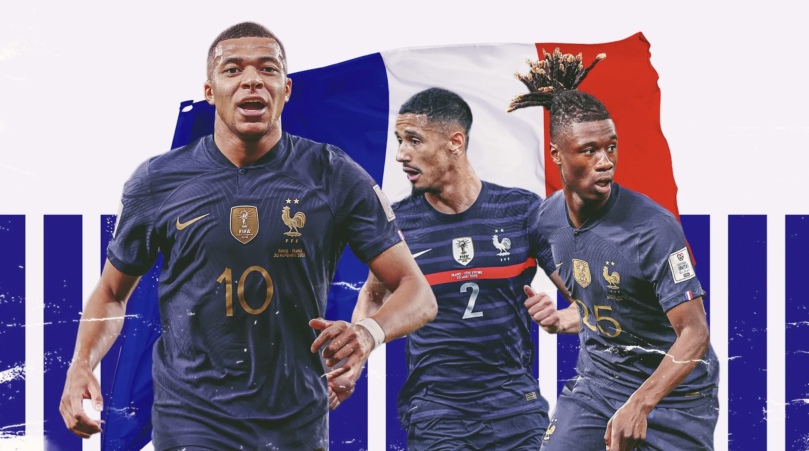

## My pick: **France!** {background-color="#f0ece4"}

MGTA 495 — Marketing Analytics

The team is a tournament-experienced squad that made it to the semi-finals during the last FIFA World Cup. They have elite players like *Kylian Mbappé*, *Ousmane Dembélé*, and *Mike Maignan*.

{.france-team-slide-img fig-align="center" width="100%"}

---

## Why France? {background-color="#f0ece4"}

- **Elite depth:** High-level talent across every area of the field, not just a few star players
- **Big-game experience:** Consistently deep tournament runs — this squad knows how to handle knockout pressure
- **Strong chemistry:** Many players are used to performing together in demanding, high-stakes matches
- **Tactical flexibility:** France can win through counterattacks, physicality, or controlling key moments
- **Match-winners:** Players who can change a game instantly with one run, pass, or finish

---

## Caveats {background-color="#f0ece4"}

<strong>Injuries</strong> — Even one key injury can completely change a team's chances.

<strong>Tournament draw</strong> — A difficult bracket path can make even the best team vulnerable.

<strong>Knockout variance</strong> — One bad performance, one mistake, or one unlucky moment can end a run.

These are the biggest reasons predictions should be **treated as probabilities, not guarantees**.
