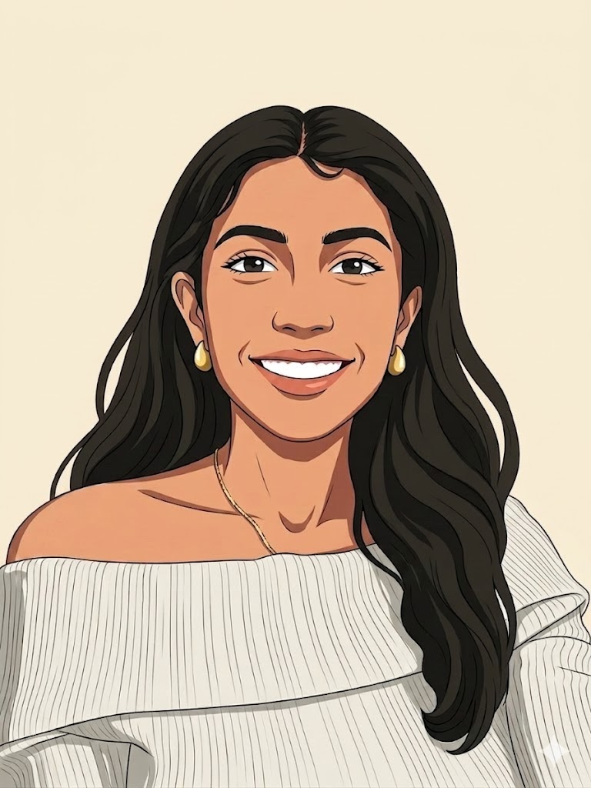
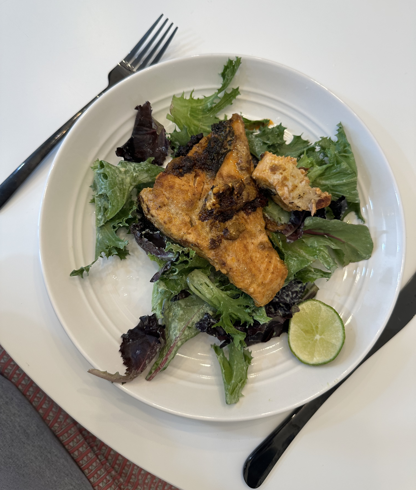
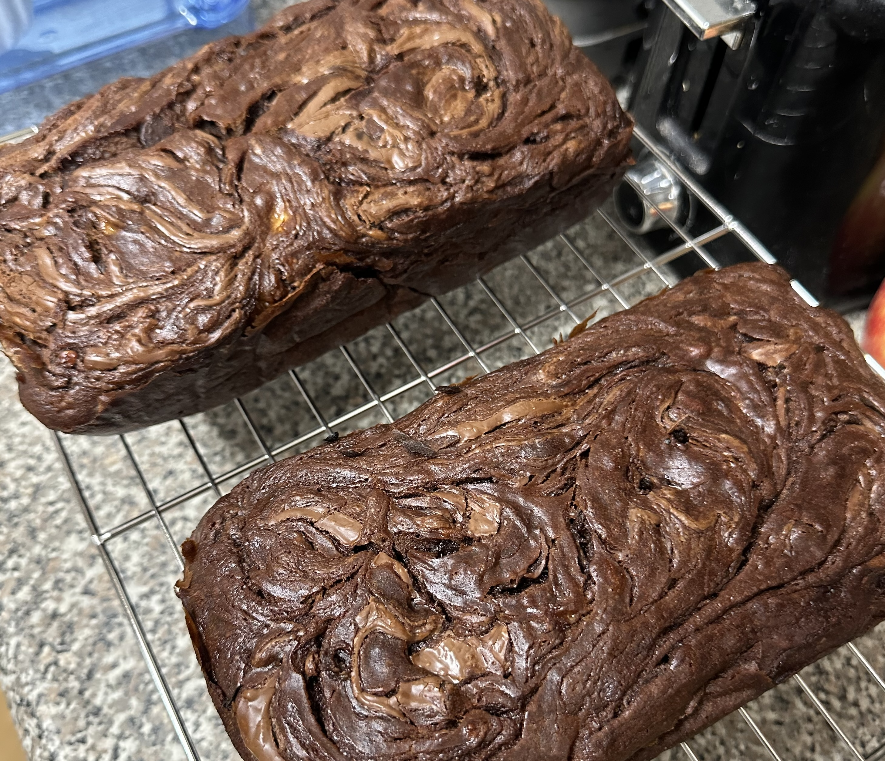
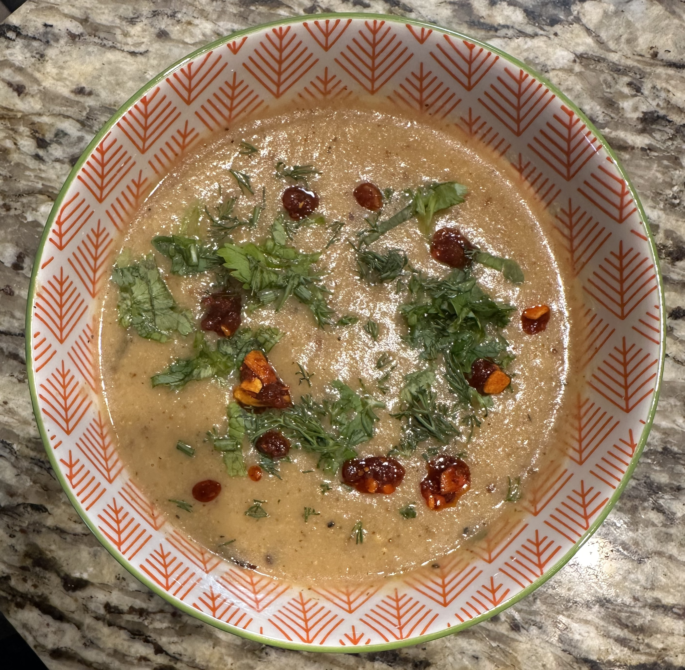
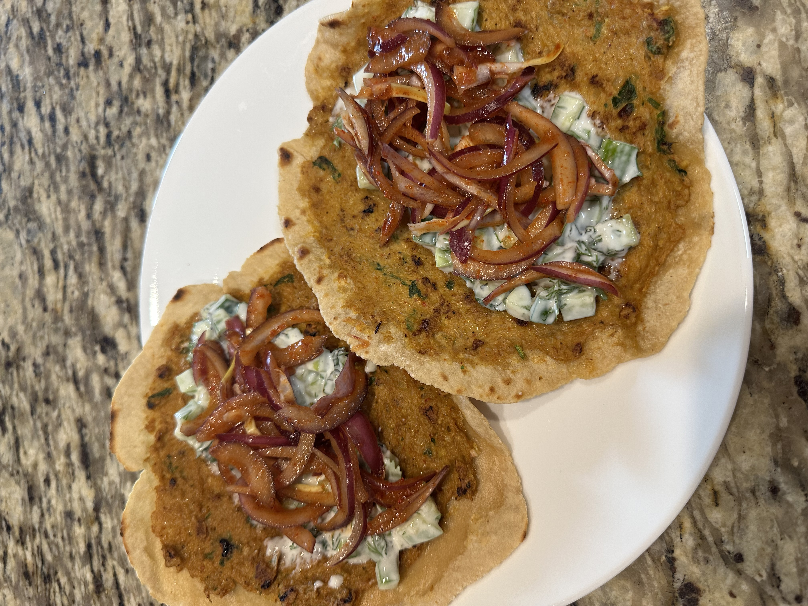

---
format:
  html:
    toc: false
    page-layout: full
    theme: none
execute:
  echo: false
---

```{=html}
<link href="https://fonts.googleapis.com/css2?family=Playfair+Display:wght@700;900&family=DM+Sans:wght@300;400;500&display=swap" rel="stylesheet">

<style>
  * { margin: 0; padding: 0; box-sizing: border-box; }

  body {
    background: #f0ece4;
    color: #2e2825;
    font-family: 'DM Sans', sans-serif;
  }

  a { color: inherit; text-decoration: none; }

  /* NAV */
  .nav {
    display: flex;
    justify-content: space-between;
    align-items: center;
    padding: 1.5rem 4rem;
    border-bottom: 1px solid #c9c2b6;
    background: #f0ece4;
    position: sticky;
    top: 0;
    z-index: 10;
  }
  .nav-logo { font-size: 0.85rem; letter-spacing: 0.1em; text-transform: uppercase; color: #7a3b35; }
  .nav-logo-link {
    display: inline-block;
    padding: 0.4rem 0.75rem;
    border: 1px solid #c9c2b6;
    transition: color 0.2s, border-color 0.2s, transform 0.2s;
  }
  .nav-logo-link:hover {
    color: #2e2825;
    border-color: #7a3b35;
    transform: translateY(-2px);
  }
  .nav-links { display: flex; gap: 2rem; list-style: none; }
  .nav-links a {
    font-size: 0.8rem; color: #8a8278;
    text-transform: uppercase; letter-spacing: 0.08em;
    padding: 0.4rem 0.75rem;
    transition: color 0.2s, background 0.2s, transform 0.2s;
    display: inline-block;
  }
  .nav-links a:hover {
    color: #2e2825;
    background: #e8e3da;
    transform: translateY(-2px);
  }
  .nav-cta {
    background: #2e2825; color: #f0ece4;
    padding: 0.5rem 1.2rem; font-size: 0.8rem;
    letter-spacing: 0.08em; text-transform: uppercase;
    transition: background 0.2s;
  }
  .nav-cta:hover { background: #7a3b35; }

  /* HERO */
  .hero {
    display: grid;
    grid-template-columns: 1fr 1fr;
    gap: 4rem;
    padding: 5rem 4rem;
    align-items: center;
    border-bottom: 1px solid #c9c2b6;
    scroll-margin-top: 80px;
  }
  .hero-name {
    font-family: 'Playfair Display', serif;
    font-size: clamp(3rem, 6vw, 6rem);
    font-weight: 900;
    line-height: 1;
    margin-bottom: 1.5rem;
    color: #2e2825;
  }
  .hero-name .outlined {
    -webkit-text-stroke: 1px #2e2825;
    color: transparent;
    display: block;
  }
  .roles { display: flex; flex-direction: column; gap: 0.4rem; margin-bottom: 1.5rem; }
  .role { font-size: 1.1rem; color: #8a8278; letter-spacing: 0.05em; }
  .hero-bio { font-size: 1.2rem; color: #6b6560; line-height: 1.8; max-width: 400px; font-style: italic; }
  /* Smaller profile image */
  .profile-box {
    width: 75%;
    margin: 0 auto;
    aspect-ratio: 3/4;
    overflow: hidden;
    border: 1px solid #c9c2b6;
  }
  .profile-box img { width: 100%; height: 100%; object-fit: cover; display: block; }

  /* SECTIONS */
  .section { padding: 5rem 4rem; border-bottom: 1px solid #c9c2b6; scroll-margin-top: 80px; }
  .section-label {
    font-size: 0.7rem;
    color: #7a3b35;
    letter-spacing: 0.2em;
    text-transform: uppercase;
    margin-bottom: 0.5rem;
  }
  .section-title {
    font-family: 'Playfair Display', serif;
    font-size: clamp(2rem, 4vw, 3.5rem);
    font-weight: 900;
    line-height: 1;
    margin-bottom: 3rem;
    color: #2e2825;
  }
  .section-title .outlined {
    -webkit-text-stroke: 1px #2e2825;
    color: transparent;
  }

  /* TWO COL */
  .two-col { display: grid; grid-template-columns: 1fr 1fr; gap: 4rem; }

  /* ABOUT / SKILLS */
  .about-bio { font-size: 0.95rem; color: #6b6560; line-height: 1.9; margin-bottom: 1rem; }
  .about-links { display: flex; gap: 1rem; flex-wrap: wrap; margin-top: 1.5rem; }
  .tag {
    font-size: 0.7rem;
    border: 1px solid #c9c2b6;
    padding: 0.35rem 0.8rem;
    color: #8a8278;
    letter-spacing: 0.08em;
    text-transform: uppercase;
    background: transparent;
    display: inline-block;
    transition: border-color 0.2s, color 0.2s, transform 0.2s;
  }
  .tag:hover { border-color: #7a3b35; color: #7a3b35; transform: translateY(-2px); }

  .skills-group { margin-bottom: 1.5rem; }
  .skills-group-title {
    font-size: 0.65rem; color: #7a3b35; letter-spacing: 0.12em;
    text-transform: uppercase; margin-bottom: 0.6rem; font-weight: 500;
  }
  .skill-tags { display: flex; flex-wrap: wrap; gap: 0.4rem; }
  .skill-tag {
    font-size: 0.68rem;
    background: #e8e3da;
    border: 1px solid #c9c2b6;
    color: #6b6560;
    padding: 0.28rem 0.65rem;
  }

  /* EXPERIENCE */
  .exp-item {
    display: grid;
    grid-template-columns: 160px 1fr auto;
    gap: 2rem;
    padding: 1.5rem 0;
    border-bottom: 1px solid #ddd8cf;
    align-items: start;
  }
  .exp-date { font-size: 0.72rem; color: #8a8278; line-height: 1.6; }
  .exp-title { font-family: 'Playfair Display', serif; font-size: 1.1rem; font-weight: 700; margin-bottom: 0.25rem; color: #2e2825; }
  .exp-company { font-size: 0.8rem; color: #8a8278; margin-bottom: 0.5rem; }
  .exp-desc { font-size: 0.82rem; color: #6b6560; line-height: 1.7; }
  .exp-badges { display: flex; flex-direction: column; gap: 0.3rem; align-items: flex-end; }
  .badge {
    font-size: 0.6rem; border: 1px solid #c9c2b6; color: #8a8278;
    padding: 0.2rem 0.5rem; white-space: nowrap; letter-spacing: 0.05em; background: #ddd8cf;
  }

  /* PROJECTS */
  .projects-grid { display: grid; grid-template-columns: repeat(3, 1fr); gap: 1rem; }
  .project-card {
    background: #e8e3da; border: 1px solid #c9c2b6; padding: 1.5rem;
    transition: transform 0.2s, box-shadow 0.2s;
    display: flex;
    flex-direction: column;
  }
  .project-card:hover {
    transform: translateY(-4px);
    box-shadow: 0 6px 20px rgba(46,40,37,0.1);
  }
  .project-num { font-size: 2rem; font-weight: 900; color: #c9c2b6; font-family: 'Playfair Display', serif; margin-bottom: 0.5rem; }
  .project-title { font-size: 0.95rem; font-weight: 500; margin-bottom: 0.5rem; color: #2e2825; }
  .project-desc { font-size: 0.78rem; color: #8a8278; line-height: 1.6; margin-bottom: 1rem; flex-grow: 1; }
  .project-footer { display: flex; justify-content: space-between; align-items: center; }
  .project-stack { display: flex; gap: 0.3rem; flex-wrap: wrap; }
  .project-tech { font-size: 0.6rem; background: #ddd8cf; border: 1px solid #c9c2b6; color: #6b6560; padding: 0.2rem 0.4rem; }
  .project-link {
    font-size: 0.7rem; color: #7a3b35;
    border-bottom: 1px solid #c9a09b; padding-bottom: 1px;
    white-space: nowrap;
  }
  .project-link:hover { color: #2e2825; border-color: #2e2825; }

  /* HOBBIES */
  .hobby-text { font-size: 0.95rem; color: #6b6560; line-height: 1.9; margin-bottom: 1.25rem; }
  .hobby-text strong { color: #2e2825; font-weight: 500; }
  .hobby-text em { color: #7a3b35; font-style: normal; font-weight: 500; }
  .food-grid {
    display: grid;
    grid-template-columns: repeat(3, 1fr);
    gap: 0.75rem;
  }
  .food-grid img {
    width: 100%; aspect-ratio: 1/1;
    object-fit: cover; display: block;
    border: 1px solid #c9c2b6;
  }

  /* CONTACT */
  .contact { padding: 5rem 4rem; text-align: center; }
  .contact-title {
    font-family: 'Playfair Display', serif;
    font-size: clamp(2.5rem, 5vw, 5rem);
    font-weight: 900; margin-bottom: 0.5rem; color: #2e2825;
  }
  .contact-title .outlined { -webkit-text-stroke: 1px #2e2825; color: transparent; }
  .contact-sub { font-size: 0.95rem; color: #8a8278; margin-bottom: 2rem; }
  .contact-email {
    font-size: 1rem; color: #7a3b35;
    border-bottom: 1px solid #c9a09b; padding-bottom: 3px;
  }
  .contact-email:hover { color: #2e2825; border-color: #2e2825; }
  .footer {
    margin-top: 4rem; padding-top: 1.5rem;
    border-top: 1px solid #c9c2b6;
    display: flex; justify-content: space-between;
    font-size: 0.7rem; color: #8a8278;
  }

  @media (max-width: 800px) {
    .nav { padding: 1rem 1.5rem; }
    .hero, .section { padding: 3rem 1.5rem; }
    .hero, .two-col { grid-template-columns: 1fr; }
    .profile-box { width: 60%; }
    .exp-item { grid-template-columns: 1fr; gap: 0.5rem; }
    .exp-badges { align-items: flex-start; flex-direction: row; flex-wrap: wrap; }
    .projects-grid { grid-template-columns: repeat(2, 1fr); }
    .food-grid { grid-template-columns: repeat(2, 1fr); }
    .contact { padding: 3rem 1.5rem; }
    .footer { flex-direction: column; gap: 0.5rem; text-align: center; }
  }
</style>

<!-- NAV -->
<div class="nav">
  <a href="#top" class="nav-logo nav-logo-link">Eesha Jagdhane // Portfolio</a>
  <ul class="nav-links">
    <li><a href="#about">About</a></li>
    <li><a href="#experience">Experience</a></li>
    <li><a href="#projects">Projects</a></li>
    <li><a href="#hobbies">Hobbies</a></li>
    <li><a href="blogs.html">Blogs &amp; Insights</a></li>
  </ul>
  <a href="#contact" class="nav-cta">Get in touch</a>
</div>

<!-- HERO -->
<div class="hero" id="top">
  <div>
    <div class="hero-name">
      <span class="outlined">Eesha</span>
      Jagdhane
    </div>
    <div class="roles">
      <span class="role">UCSD MS in Business Analytics Student</span>
    </div>
    <p class="hero-bio">
      Turning data into insights, and insights into impact
    </p>
  </div>
  <div class="profile-box">
    
  </div>
</div>

<!-- ABOUT & SKILLS -->
<div class="section" id="about">
  <div class="section-label">Who I Am</div>
  <div class="section-title">About <span class="outlined">Me</span></div>
  <div class="two-col">
    <div>
      <p class="about-bio">
        I'm a data and business analytics professional with experience using data to improve
        reporting, streamline workflows, and support stronger business decision-making. My
        background includes analytics, process improvement, and translating complex information
        into clear, practical insights that help teams solve operational and strategic problems.
      </p>
      <p class="about-bio">
        I'm currently pursuing my MS in Business Analytics at UC San Diego, where I'm continuing
        to build my skills in business analytics, machine learning, and data-driven strategy.
        I'm especially interested in roles where I can combine technical analysis with business
        problem-solving to improve processes, uncover meaningful insights, and support
        cross-functional decision-making.
      </p>
      <p class="about-bio">
        I'm also interested in how analytics, AI, and machine learning can be applied in
        practical ways to strengthen operational efficiency, support strategy, and create
        measurable business impact.
      </p>
      <div class="about-links">
        <a href="mailto:eeshaj811@gmail.com" class="tag">Email</a>
        <a href="resume.pdf" class="tag">Resume</a>
        <a href="https://linkedin.com/in/eesha-jagdhane" class="tag">LinkedIn</a>
      </div>
    </div>
    <div>
      <div class="skills-group">
        <div class="skills-group-title">Programming &amp; Data</div>
        <div class="skill-tags">
          <span class="skill-tag">SQL</span>
          <span class="skill-tag">Python</span>
          <span class="skill-tag">Pandas</span>
          <span class="skill-tag">NumPy</span>
          <span class="skill-tag">Scikit Learn</span>
          <span class="skill-tag">PostgreSQL</span>
          <span class="skill-tag">Snowflake</span>
          <span class="skill-tag">AWS Athena</span>
          <span class="skill-tag">Excel</span>
          <span class="skill-tag">R</span>
        </div>
      </div>
      <div class="skills-group">
        <div class="skills-group-title">Visualization &amp; Tools</div>
        <div class="skill-tags">
          <span class="skill-tag">Tableau</span>
          <span class="skill-tag">Tableau Prep</span>
          <span class="skill-tag">PowerPoint</span>
          <span class="skill-tag">Dashboard Development</span>
          <span class="skill-tag">KPI Reporting</span>
        </div>
      </div>
      <div class="skills-group">
        <div class="skills-group-title">Analytics &amp; Business</div>
        <div class="skill-tags">
          <span class="skill-tag">Data Validation</span>
          <span class="skill-tag">Exploratory Data Analysis</span>
          <span class="skill-tag">Reporting Automation</span>
          <span class="skill-tag">Process Improvement</span>
          <span class="skill-tag">Business Analysis</span>
          <span class="skill-tag">Requirements Translation</span>
          <span class="skill-tag">Stakeholder Communication</span>
        </div>
      </div>
      <div class="skills-group">
        <div class="skills-group-title">Modelling &amp; Statistics</div>
        <div class="skill-tags">
          <span class="skill-tag">A/B Testing</span>
          <span class="skill-tag">Hypothesis Testing</span>
          <span class="skill-tag">Regression</span>
          <span class="skill-tag">Forecasting</span>
          <span class="skill-tag">Tree Models</span>
          <span class="skill-tag">Neural Nets</span>
        </div>
      </div>
      <div class="skills-group">
        <div class="skills-group-title">Collaboration &amp; Project Tools</div>
        <div class="skill-tags">
          <span class="skill-tag">Git</span>
          <span class="skill-tag">GitHub</span>
          <span class="skill-tag">JIRA</span>
          <span class="skill-tag">Documentation</span>
        </div>
      </div>
      <div class="skills-group">
        <div class="skills-group-title">AI Tools</div>
        <div class="skill-tags">
          <span class="skill-tag">ChatGPT</span>
          <span class="skill-tag">Claude</span>
          <span class="skill-tag">Gemini</span>
          <span class="skill-tag">Claude Code</span>
          <span class="skill-tag">Codex</span>
        </div>
      </div>
      <div class="skills-group">
        <div class="skills-group-title">Languages</div>
        <div class="skill-tags">
          <span class="skill-tag">English</span>
          <span class="skill-tag">Marathi</span>
          <span class="skill-tag">Hindi</span>
        </div>
      </div>
    </div>
  </div>
</div>

<!-- EXPERIENCE -->
<div class="section" id="experience">
  <div class="section-label">What I've Done</div>
  <div class="section-title">Work <span class="outlined">Experience</span></div>
  <div class="exp-item">
    <div class="exp-date">Mar 2026 – Present</div>
    <div>
      <div class="exp-title">AI Engineer</div>
      <div class="exp-company">Dhauz | QuantumRise — San Diego, CA, U.S.A</div>
      <div class="exp-desc">In this capstone project, I’ve taken on both a technical and team-facing role. As an AI Engineer, I help develop an agentic AI solution aimed at making nurses’ day-to-day work easier by giving them quicker access to patient information, clinical context, and early alerts for deterioration risks. My work involves supporting the technical direction of the project, exploring the MIMIC-IV dataset, and contributing to how we structure the Python- and SQL-based solution behind the prototype. At the same time, I serve as the key communicator for the team, which means I put together our weekly presentations, draft meeting agendas, and handle communication with the Dhauz | Quantumrise team. I’ve really enjoyed being in a role where I can contribute both to the technical side of the project and to making sure our team stays organized, aligned, and professional in how we work with stakeholders.</div>
    </div>
    <div class="exp-badges">
      <span class="badge">AI Tools</span>
      <span class="badge">SQL</span>
      <span class="badge">Python</span>
      <span class="badge">PowerPoint Presentation</span>
    </div>
  </div>
  <div class="exp-item">
    <div class="exp-date">Apr 2023 – Jun 2025</div>
    <div>
      <div class="exp-title">Data Analyst</div>
      <div class="exp-company">Morningstar DBRS — Chicago, IL, U.S.A</div>
      <div class="exp-desc">Designed and implemented 20+ Tableau flows and databases providing accurate, decision-ready data for team analysis. Using Excel, Python, and SQL, built and validated schemas, automated recurring data ingestion, validation, and dashboard refreshes. Integrated climate risk data through an API into the ratings workflow on an ESG initiative. Documented methods, presented insights to stakeholders, and created process guides that helped onboard more than three new team members.</div>
    </div>
    <div class="exp-badges">
      <span class="badge">SQL</span>
      <span class="badge">Python</span>
      <span class="badge">Tableau</span>
    </div>
  </div>
  <div class="exp-item">
    <div class="exp-date">Jul 2022 – Apr 2023</div>
    <div>
      <div class="exp-title">Credit Ratings Analyst</div>
      <div class="exp-company">Morningstar DBRS — Chicago, IL, U.S.A</div>
      <div class="exp-desc">Used advanced Excel and statistical analysis to model net cash flows and support investment decisions. Maintained 99% accuracy in a fast-paced deal environment by adapting quickly to revisions and staying highly detail-oriented. Consolidated complex files and data sources into a single auditable repository, streamlining workflows and improving turnaround times.</div>
    </div>
    <div class="exp-badges">
      <span class="badge">Excel</span>
      <span class="badge">SQL</span>
    </div>
  </div>
</div>

<!-- PROJECTS -->
<div class="section" id="projects">
  <div class="section-label">My Work</div>
  <div class="section-title">Recent <span class="outlined">Projects</span></div>
  <div class="projects-grid">
    <div class="project-card">
      <div class="project-num">01</div>
      <div class="project-title">Agentic Nurse</div>
      <div class="project-desc">Developed an agentic AI prototype to monitor patient conditions and surface early deterioration alerts via Telegram. Translated nurse workflows into user stories, validated use cases using MIMIC-IV SQL views, and designed Python evaluation frameworks for accuracy, latency, and clinical safety.</div>
      <div class="project-footer">
        <div class="project-stack">
          <span class="project-tech">Python</span>
          <span class="project-tech">SQL</span>
          <span class="project-tech">Agentic AI</span>
        </div>
      </div>
    </div>
    <div class="project-card">
      <div class="project-num">02</div>
      <div class="project-title">Community Partners Databasing</div>
      <div class="project-desc">Created schemas for nonprofit organization data at Morningstar and developed a Python widget for querying, updating, adding, and deleting data synchronized with the data lake. Prepared full project documentation and user instructions.</div>
      <div class="project-footer">
        <div class="project-stack">
          <span class="project-tech">Python</span>
          <span class="project-tech">Excel</span>
        </div>
      </div>
    </div>
    <div class="project-card">
      <div class="project-num">03</div>
      <div class="project-title">Incremental Learning Model</div>
      <div class="project-desc">Built a deep learning model supporting continuous updates as new image data became available, achieving 98.1% test accuracy. Implemented data augmentation using a similarity index to identify distorted images and documented the full model development process.</div>
      <div class="project-footer">
        <div class="project-stack">
          <span class="project-tech">Python</span>
          <span class="project-tech">TensorFlow</span>
          <span class="project-tech">Keras</span>
        </div>
      </div>
    </div>
  </div>
</div>

<!-- HOBBIES -->
<div class="section" id="hobbies">
  <div class="section-label">Beyond Work</div>
  <div class="section-title">Hobbies &amp; <span class="outlined">Interests</span></div>
  <div class="two-col">
    <div>
      <p class="hobby-text">
        I love <strong>cooking</strong> and <strong>baking</strong> and have been doing both
        since sixth grade. I am a <strong>big foodie</strong> and enjoy trying
        <strong>new restaurants and dishes</strong>, especially around San Diego. Some of my
        favorite spots are Seneca, Callie, Taco Stand, Din Tai Fung, and Ramen Nagi.
      </p>
      <p class="hobby-text">
        I also enjoy <strong>reading</strong>, especially fiction and mystery, though I am
        usually open to almost anything. Lately I have been drawn to books that help me step
        away from work and assignments for a bit.
      </p>
      <p class="hobby-text">
        When I have the time, I enjoy <strong>painting</strong> and <strong>sketching</strong>
        as well. I actually started college as a studio arts major before eventually switching
        to finance and data analytics, so creativity has always been an important part of
        who I am.
      </p>
      <p class="hobby-text">
        I am also a big fan of <strong>video games</strong>. I have played all the
        <em>Uncharted</em> games, play <em>Call of Duty</em> occasionally, and especially
        enjoy co-op adventure games like <em>It Takes Two</em>, <em>Split Fiction</em>,
        <em>Mario Kart</em>, and <em>Overcooked</em>.
      </p>
    </div>
    <div>
      <div class="food-grid">
        
        
        
        
        
        
      </div>
    </div>
  </div>
</div>

<!-- CONTACT -->
<div class="contact" id="contact">
  <div class="contact-title">Let's <span class="outlined">Connect</span></div>
  <p class="contact-sub">Open to opportunities, collaborations, and interesting conversations.</p>
  <a href="mailto:eeshaj811@gmail.com" class="contact-email">eeshaj811@gmail.com</a>
  <div class="footer">
    <span>© 2026 Eesha Jagdhane</span>
    <span style="color: #7a3b35;">Built with Quarto</span>
    <span>San Diego, CA</span>
  </div>
</div>

<style>
  .scroll-reveal {
    opacity: 0;
    transform: scale(0.92) translateY(40px);
    transition: opacity 0.9s ease, transform 0.9s ease;
  }
  .scroll-reveal.visible {
    opacity: 1;
    transform: scale(1) translateY(0);
  }
</style>

<script>
  const sections = document.querySelectorAll('.section, .hero, .contact');
  const observer = new IntersectionObserver((entries) => {
    entries.forEach(entry => {
      if (entry.isIntersecting) {
        entry.target.classList.add('visible');
      } else {
        entry.target.classList.remove('visible');
      }
    });
  }, { threshold: 0.08 });
  sections.forEach(el => {
    el.classList.add('scroll-reveal');
    observer.observe(el);
  });
</script>
```
